  

# Hi, I'm Hasan Mohamed 👋

### Aspiring AI/ML Engineer | Electrical & Electronics Engineering Student | Building in Public

---

## 🚀 About Me

I'm a first-year **Electrical & Electronics Engineering** student with a clear goal of becoming an **AI/ML Engineer**.

I'm building my skills from the ground up—learning the fundamentals, creating real-world projects, and documenting my journey publicly. I believe that consistent learning and practical implementation are the fastest ways to grow as an engineer.

---

## 🌱 Current Learning Journey

* 🔭 Building end-to-end **Exploratory Data Analysis (EDA)** projects
* 🐍 Strengthening my Python programming skills
* 📊 Learning **NumPy**, **Pandas**, and **Data Visualization**
* 🤖 Preparing to learn **Scikit-learn** and core Machine Learning algorithms
* ✍️ Sharing my learning journey through technical articles on Medium

---

## 🛠️ Tech Stack

  
  
  
  
  
  
  

---

## 📌 Featured Projects

### 📊 Student Performance EDA

**Repository:**
[https://github.com/hasanmd-08/student-eda-walkthrough]

End-to-end exploratory data analysis on a student performance dataset, uncovering patterns between attendance, study habits, and academic performance through data cleaning, visualization, and statistical analysis.

### 📈 House Price Regression
**Repository:** 
[https://github.com/hasanmd-08/house-price-regression]

My first machine learning model — a Linear Regression model predicting house prices from square footage, bedrooms, age, and location tier, including train/test evaluation and a deep dive into how an outlier skews predictions.

### 👥 Customer Segmentation using K-Means Clustering
**Repository:** 
[https://github.com/hasanmd-08/hasanmd-08-mall-customer-segmentation-KMeans]

My first unsupervised machine learning project — building a K-Means Clustering model to identify distinct customer segments from annual income and spending behavior, including feature scaling, optimal cluster selection using the Elbow Method, and business-focused interpretation of each segment.

### 🌸 Iris Flower Classification using Logistic Regression & Decision Tree  
**Repository:** 
[https://github.com/hasanmd-08/iris-species-classification]  

My supervised machine learning classification project — building and comparing Logistic Regression and Decision Tree models to classify Iris flower species based on sepal and petal measurements, including exploratory data analysis (EDA), model training, performance evaluation using accuracy, confusion matrix, and classification report, decision tree visualization, and prediction on new flower samples.

---

## 🎯 2026 Goals

* ✅ Build a strong GitHub portfolio
* 📊 Complete multiple EDA projects
* 🤖 Learn core Machine Learning algorithms
* 🧠 Build end-to-end ML projects
* 🌍 Contribute to open-source projects
* 💼 Prepare for AI/ML internships

---

## 📫 Connect With Me

* 💼 LinkedIn: https://www.linkedin.com/in/hasan-mohamed-926230395
* ✍️ Medium: https://medium.com/@hasan.huraira704

---

<strong>Learning consistently. Building continuously. Improving every day.</strong>

